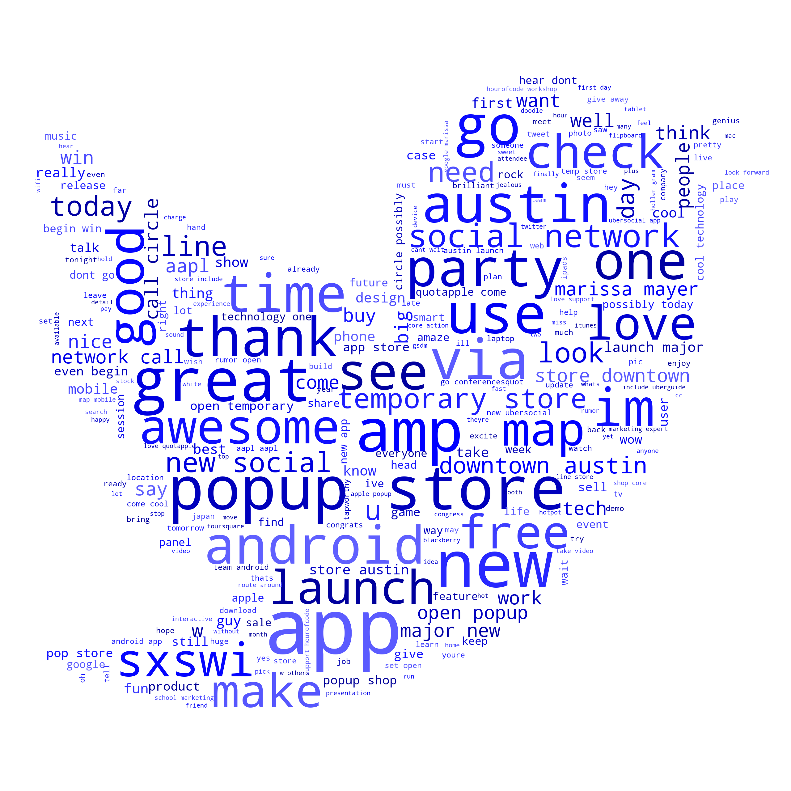
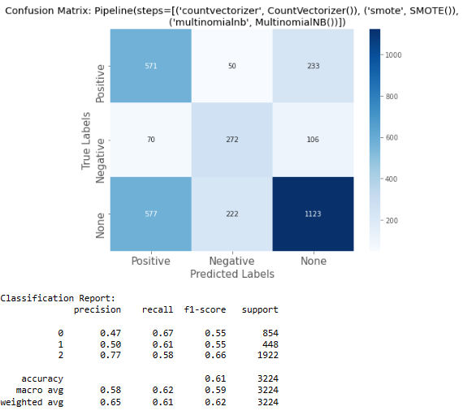

# Phase 4 Project - 
## Natural Language Processing Model for Twitter Reviews on Android, Apple, and Google

Name: Andrew Levinton
Student Pace: Self Pace
Instructor name: Ahbhineet Kukarni

# Tech Stack
- Python
- Pandas
- Matplotlib
- Seaborn
- Scikit-learn
- Natural Language Toolkit


# Business  Problem

In this study, we will be analyzing tweets from twitter to help present findings on sentiment towards product related to Android, Apple, and Google. Many companies want to keep track of public sentiment about various products. Positive sentiment might drive production for creators or inventory management for retailers. It might drive the attention of influencers, news organizations, and consumers. Twitter is a platform where individuals and companies express themselves and have conversations and is full of information about how people feel about particular products.


## I. Business Understanding
The goals of the business problem will be:

1. Analyze tweets from twitter to gain insight of sentiment towards various products. 
2. Determine which features of tweets best show as the best predict if tweets can be categorized as positive, negative, or neither. 
3. Maximize positive sentiment for products from the following companies. 

### Business Questions to consider:
1. Do customers have positive or negative sentiment towards Apple, Android, or Google products?
2. Which products might retailers want to keep in their stores to maxmize profit in inventory management?
3. Which products might influencers want to highlight in their posts to gain the most attraction?

### The problem with sentiment
Emotions are also relative. Consdier the phrase, "iPhones are better than Android phones." Is this a positive or a negative tweet? It depends! For this reason purposeful data preprocessing will be essential to building data categorization before training it on the model itself. There is a LOT of cleaning that needs to occur, with tweets containing many various symbols and characters that will distract the model from providing an accurate prediction. 


# II. Data Understanding


## The Data

The model below was trained on two datasets from the website data.world's [crowdflower](https://data.world/crowdflower):
- [Brands and Product Emotions](https://data.world/crowdflower/brands-and-product-emotions)
Judge Emotion About Brands and Products
- [Apple Twitter Sentiment](https://data.world/crowdflower/apple-twitter-sentiment)

Our base data, which is the Brands and Product Emotions dataset, comes with three columns with categorical values, with every row being a separate tweet. The first column contains the text of the tweet. This text is copied striahgt from the original source, so it contains all the little unique things that tweets such as '@' mentions and '#' hashtags. The second column contains the target of the tweet. The target can be subjects such as 'iPad', 'iPhone', or 'Google' to name a few, and they denote what their respective tweet's subject is. For example, if the tweet target is 'Android App', we can assume that the tweet text in the same row has something to do with it. The last column contains the tweet sentiment, or the type of emotion the tweet text is showing. There are three possible values: positive, negative, and no emotion. A positive value would symbolize that the tweet has a positive feeling towards their listed target, while the opposite would be true if it was negative. A value of no emotion would mean that the tweet does not have a particularily strong feeling towards either side. As the tweet sentiment is the value that we are trying to predict, this will be our target column in our predictive models.


In our combined dataset, unfortunately there is a major class imbalance. The 'none' category representing no emotion for tweets being such a large portion of the dataset is cause for concern as it can lead to the model getting a high accuracy score simply by guessing 'none' for every tweet. 

To address this class imbalance, an oversampling method called SMOTE(Synthetic Minority Over-sampling TEchnique) is used.

### SMOTE
SMOTE (Synthetic Minority Over-sampling Technique) is a popular technique used in the context of imbalanced classification problems. Imbalanced classification occurs when the distribution of classes in the training data is highly skewed, meaning one class (the minority class) has significantly fewer samples compared to the other class(es) (the majority class).

The main use case and purpose of SMOTE are to address the imbalanced class distribution and improve the performance of machine learning models, especially in scenarios where the minority class is of particular interest and misclassification of the minority class is more critical.

# Feature Engineering

In the dataset, the three companies that were analyzed were apple, google, and android. However, to improve the model we narrowed the product distribution just to address the companies themselves. With Apple containing so many different products and Google having some different products and services as well, this allowed for a reduction in complexity thus helping to prevent overfitting. 


### Apple 
> - iphone
> - ipad
> - iphone app
> - other apple product or service
> - ipad
> - apple

### Android
> - android app
> - android

### Google
> - google
> - other google product or service


Similarly, the dataframe simplified the names of the emotion targets as well. For the same reasoning, the targets that contain the same sentiment but different text will also cause an overcomplexion in the model when running. 
### negative
>- negative emotion
### positive 
>- positive emotion
### none
>- no emotion toward brand or product
> - can't tell
                                                                          

# Resulting dataframe


# Data Cleaning and Processing

As our tweet text comes straight from the source, they are undoubtedly very messy. We must first preprocess the data in order to convert them to a form safe for consumption by our predictive models. The following is a list of processes we took to turn our dirty source tweets into clean, filtered data:

1. Split the tweet into tokens
2. Convert all capitalized letters into lower-case
3. Remove punctuation
4. Remove random twitter symbols such as @ mentions
5. Remove leftover numbers
6. Remove words with accents
7. Remove stop words
8. Remove empty strings
9. Lemmatize the words
10. Rejoin all the tokens into one string

Here is an example of a tweet looks like after we undergo cleaning on it:
## Text Before Cleaning:
###  "~RT~ ~@LaurieShook:~ I~'~m look~ing~ forward ~to the~ ~#~SMCDallas pre ~#SXSW~ party Wed~.,~ ~and~ hop~ing~ I~'~ll win ~an~ ~#iPad~ result~ing~ ~from~ ~my~ shameless promotion~.~  ~#~ChevySMC"

## Text After Cleaning:
### "im look forward smcdallas pre party wed hop ill win result shameless promotion chevysmc"


# Word Cloud Display

Text is prepped and stored in the directory to be sent to another notebook in the repository to create a visual for the presentation. 

# Negative Wordcloud Display

# Positive Wordcloud Display

# Neutral Wordcloud Display


## Model Selection and Evaluation
The distribution of the target column influences the choice of evaluation metrics and the selection of an appropriate model. Understanding the distribution allows for better evaluation and comparison of different models, as well as assessing their effectiveness in capturing the desired sentiment patterns.

## Confusion matrix evaluation for False Negatives - Recall

- **Recall**, also known as sensitivity or true positive rate, measures the proportion of actual positive cases correctly identified by the model. It focuses on minimizing false negatives, which means it aims to avoid classifying positive cases as negative. 

- By emphasizing recall in the context of tweet sentiment analysis, the model aims to correctly identify as many positive, negative, or neutral tweets as possible, minimizing the chances of missing important cases. This enables the business to take appropriate actions, such as adjusting their business plan to minimize negative tweets and maximize positive tweets. 

## Baseline: Shallow Multinomial Naive Bayes

A Multinomial Naive Bayes model is a probabilistic classification algorithm commonly used in natural language processing (NLP) tasks. It is an extension of the Naive Bayes algorithm, which assumes that features (words in NLP) are conditionally independent given the class label.



## Observations


### Class "Positive":
- Precision: 0.47 - The model correctly identifies positive tweets 47% of the time among all predicted positive tweets.
- Recall: 0.67 - The model captures only 67% of actual positive tweets among all actual positive tweets.


### Class "Negative":
- Precision: 0.50 - The model correctly identifies negative tweets 50% of the time among all predicted negative tweets.
- Recall: 0.62 - The model captures only 62% of actual negative tweets among all actual negative tweets.


### Class "No Emotion":
- Precision: 0.77 - The model correctly identifies tweets with no emotion 77% of the time among all predicted no emotion tweets.
- Recall: 0.58 - The model captures 58% of actual no emotion tweets among all actual no emotion tweets.

- Accuracy:
- Overall accuracy: 0.61 - The model's predictions are correct for 61% of all tweets.

## Analysis:

The model performs reasonably well for the "No Emotion" class, with a high recall, precision, and F1-Score. This indicates that the model is effective at identifying tweets with no discernible sentiment.
However, the model struggles with the "Positive" and "Negative" classes, as indicated by low recall. This suggests that the model has difficulty distinguishing between these sentiment classes.

## Iteration 2: XGBoost Pipeline
XGBoost (eXtreme Gradient Boosting) is a powerful and widely used machine learning algorithm designed for supervised learning tasks, including both classification and regression problems. It is an implementation of the gradient boosting framework that has gained popularity due to its exceptional performance and scalability.


## Observations


### Class "Positive":
- Precision: 0.62 - The model correctly identifies positive tweets 62% of the time among all predicted positive tweets.
- Recall: 0.43 - The model captures only 43% of actual positive tweets among all actual positive tweets.


### Class "Negative":
- Precision: 0.63 - The model correctly identifies negative tweets 63% of the time among all predicted negative tweets.
- Recall: 0.45 - The model captures only 45% of actual negative tweets among all actual negative tweets.


### Class "No Emotion":
- Precision: 0.70 - The model correctly identifies tweets with no emotion 70% of the time among all predicted no emotion tweets.
- Recall: 0.85 - The model captures 85% of actual no emotion tweets among all actual no emotion tweets.

- Accuracy:
- Overall accuracy: 0.68 - The model's predictions are correct for 68% of all tweets.

## Analysis:

The model performs reasonably well for the "No Emotion" class, with a high recall, precision, and F1-Score. This indicates that the model is effective at identifying tweets with no discernible sentiment.
However, the model struggles with the "Positive" and "Negative" classes, as indicated by low recall. This suggests that the model has difficulty distinguishing between these sentiment classes.

## Iteration 3: Grid Search with Cross Validation


## Using GridSearchCV
- `GridSearchCV` is a class in scikit-learn that performs an exhaustive search over a specified parameter grid to find the best hyperparameters for a given machine learning model. It is a technique for hyperparameter tuning, which involves finding the optimal combination of hyperparameters that maximizes the model's performance.

- `Cross-validation:` GridSearchCV performs cross-validation, which is a technique for evaluating the model's performance on multiple subsets of the training data. It splits the training data into multiple folds, trains the model on a subset of the folds, and evaluates its performance on the remaining fold. This process is repeated for each fold, and the results are averaged to get an overall performance estimate.


## Best Model - Gridsearch with Multinomial Bayes, Tfidf Vectorizer and SMOTE

After many iterations, the Multinomial Bayes model has proved to be the best model. This model although not performing the highest in accuracy overall has the best results with positive and negative tweets, without losing too much accuracy on the neutral tweets. Predictions on the rest of the model did a great job on neutral tweets, but was lacking in identifying negative tweets, which was the goal of this study. Overall this model also only lost a mere 3% on the overall accuracy compared to the XGboost model. 

- When finding a model for predicting the sentiment of a tweet, the multinomial bayes using gridsearch cross validation showed the best recall for learning how to maximize false negatives. 

- The gridsearch model performed at a 66% accuracy

- For class 0 (positive), a recall of 0.63 indicates that the classifier correctly identified 63% of the actual positive instances. In other words, 63% of the tweets that were positive were correctly classified as positive.

- For class 1 (negative), a recall of 0.67 indicates that the classifier correctly identified 67% of the actual negative instances. In other words, 67% of the tweets that were negative were correctly classified as negative.

- For class 2 (neutral), a recall of 0.67 indicates that the classifier correctly identified 67% of the actual neutral instances. In other words, 67% of the tweets that were neutral were correctly classified as neutral.

# Recommendations

## For positive sentiment:
- look for tweets containing these key words or phrases:
    - 'new social network'
    - 'store downtown austin'
    - 'social network call'
    - 'launch major new'
    - 'major new social'
    
## For Negative sentiment:
- look for tweets containig these key words or phrases:
    - 'one outlet computer'
    - 'outlet computer need'
    - 'need battery future'
    - 'computer need battery'
    - 'store nyc anger'
    - 'protest store nyc'

# Future Work

Moving forward, some essential moves that will be needed in order to improve the model and business usage will be to increase the data sample and find one that is more balanced. The companies that may be interested in this will also want to look at tweets by product as well to focus more on which products are producing the worst or best sentiment and may be the leader in affecting stock prices by tweets.


```python

```
